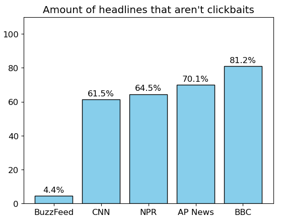

# Detecting clickbait 

## What is clickbait?

Clickbaits are news articles which encourage the users to click on them, often by using exaggerated, misleading and/or alarmist headlines, and giving promises of content in the headline that they don't actually deliver in the article. A classic clickbait could say, for example, “You wouldn’t believe how amazing this new method is!”. This headline tries to catch the attention of the reader by promising something new and amazing, even saying that you wouldn’t believe how good it is. 

The headline, however, does not elaborate on what method we are talking about, or why does it work. The user needs to click the headline and read the article to see those details. The article is usually disappointing, though. It doesn't live up to the hype in the headline or might not even answer the question in it. 

The incentive for making such clickbait headlines is often financial, as by the time the user has clicked on the article, they would have to watch the ads attached to it. Since authors of web articles who rely on ad revenue are often paid by the view, it is in the author's interest to try to get as many users to click on the article as possible, even by using such dubious clickbait methods to do so.

Many people consider clickbait to be an issue, in part because the content of the article often does not match the exaggerated headline and leaves the reader disappointed and feeling like their time was wasted. In addition, clickbait articles are often considered to be talking about irrelevant things, not actual news that the user would need to read. They catch your attention and move it away from content that is actually interesting, useful and relevant.

The use of clickbait could potentially be seen as a sign of lower-quality journalism, as relying on these tactics can be manipulation of the web user.

Look familiar? These are some prime examples of clickbait-y content found on the web.

## Amount of clickbait found on news sites

We analysed four big news sites: CNN, NPR, AP News, BBC News, plus the infamous Buzzfeed known for having large amounts of clickbait. Using a commonly accepted definition of clickbait, we used machine learning to analyse the headlines found on these sites. Our results have a 90% accuracy, so they reliably show the state of the analysed news sites.

Our analysis shows the results in terms of the percentage of articles that are not clickbait, so the higher the bar, the more "actual news" the site has. This gives reader the chance to see which news sites they could read, if they also want to avoid clickbait articles. Or if you _really_ want to read some lighthearted, clickbait-y content, just pick a site with a shorter bar.

This plot shows the results for the sites we have analysed so far.
